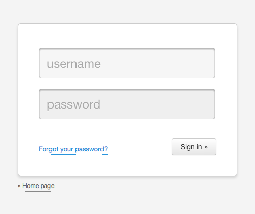

.. _quickstart:

=============================================
Tutorial
=============================================

.. container:: lead

    This guide covers what you need to know to start using Authcode.

Installation
=============================================

.. code-block:: shell

    pip install authcode

Quick Start
=============================================

Using Authcode is your app is just three step process:

1. Create a Auth object
---------------------------------------------

.. code-block:: python

    auth = authcode.Auth(SECRET_KEY, db=db)
    User = auth.User

There are several parameters that you can use to configure it, but at least you must provide a secret key and a connection objet to SQLAlchemy.

``The object db`` is what you get from `SQLAlchemy_Wrapper <https://github.com/jpscaletti/SQLAlchemy-Wrapper/>`_ [1]_ or `Flask_SQLAlchemy <http://pythonhosted.org/Flask-SQLAlchemy />`_.

``Auth.User`` is the user model automatically generated by Authcode. You will need this reference for creating users or relate it to your other models.

.. tip::

    Don't have a ``db`` because you are using SQLAlchemy directly? [1]_
    Read the section :ref:`advanced.naked_sqlalchemy` to find out how to proceed.

2. Setup for your framework
---------------------------------------------

The next step is to setup the newly created Auth object for the web framework you're using. For instance, with Flask you do:

.. code-block:: python

    authcode.setup_for_flask(auth, app)

This setup function configure Authcode with the peculiarities of the framework you´re using, such as how to render the templates, mount views and things like that.

For now, these are the framework included with the library:

* `Flask <http://flask.pocoo.org/>`_ (See :ref:`api.setup_for_flask`)
* `Bottle <http://bottlepy.org/>`_ (See :ref:`api.setup_for_bottle`)

3. Protect your views
---------------------------------------------

Finally, you use ``auth.protected`` to decorate the views you want that are only accessible to users.

.. code-block:: python

    @app.route('/')
    @auth.protected()
    def index():
        ...

.. note::
    Note that the decorator is being called (have a pair of parentheses at the end of the line). These are necessary, don´t forget to write them.

.. warning:: Warning!
    If you define the URLs of your views by decorating them —like you do in Flask— be careful to put the decorator authentication **after** the route, otherwise your views will be unprotected. Do it this way:

   .. code-block:: python
      :emphasize-lines: 2

        @app.route('/admin/')
        @auth.protected()
        def myview():
            ...

.. seealso::

    This decorator has other options, such as specifying roles that the user must have to enter a page. Red more about it in this guide :ref:`authorization`.

Authcode automatically generates views for login, logout and restoring your password, so when you try to visit the this page, it will redirect you to the included default login page.

   Default login page.

Note than that page also has a link to another one to rest your password; The method is the standard: you write your username and Authcode sends you an email with a special link to choose a new password.

For this to work, it needs a way to send the email, that's a feature that your application must provide[2]_. For example, it might look like this:

.. code-block:: python

    def send_auth_email(user, subject, msg):
        try:
            mailer.send(
                subject=subject,
                from_email=config.MAILER_FROM,
                to=user.email,
                html=msg
            )
        except Exception as e:
            print(e)

    Authcode.setup_for_flask(auth, app, send_email=send_auth_email)

The function that you pass to ``send_email`` takes as arguments the user who wants to recover his password, the subject and body of the message (by default in HTML). Of course you must have an email associated with the user, so either you use your email as username (login) or add an email field using a *mixin* as described in the next section (:ref:`authentication`).

See the code of this example in https://github.com/jpscaletti/Authcode/tree/master/examples/minimal.

.. [1] `SQLAlchemy-Wrapper <https://github.com/jpscaletti/SQLAlchemy-Wrapper/>`_ will save you a lot of the work needed to initialize ``SQLAlchemy``, regardless of whether you use Authcode or not.

.. [2] or you can also disable it completely in the settings.