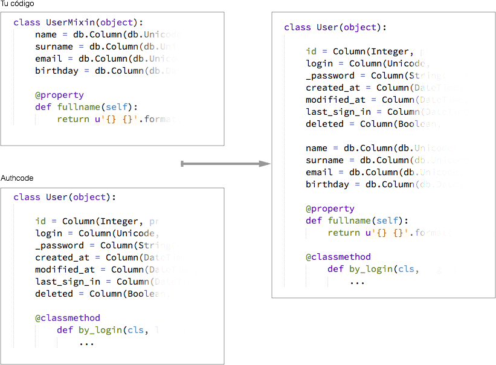

.. _authentication:

=============================================
Autenticación
=============================================

.. container:: lead

    La **autenticación** es el verificar que un usuario sea quien dice ser.

    Authcode separa la *autenticación* del *login*. La parte de autenticación recibe unas credenciales —como un nombre de usuario y una contraseña— y regresa al usuario identificado.

    El login recibe a ese usuario y guarda en la *cookie* de sesión del navegador un código para identificarlo en el sitio por el resto de su sesión (hasta que haga manualmente *logout* por ejemplo).

Integración con tus modelos
=============================================

Aunque Authcode genera un modelo de usuario por defecto, no tendría sentido que no te dejara integrarla con tu propio modelo de usuarios.

El problema con otras bibliotecas y frameworks del pasado han obligado a usar su modelo de usuarios, con su estructura y sin que le puedas agregar nuevos campos o ni siquiera definir el nombre de la tabla. Creo que eso es pedir demasiado.

Authcode en cambio, aprovecha el poder de SQLAlchemy y los *mixins* para dar la mayor flexibilidad sin sacrificar funcionalidad.

Funciona de esta forma: parte de una estructura mínima predefinida para el modelo de usuarios y le agrega cualquier otro campo o método que tu definas en una clase.

.. note::

    Puedes llamar la tabla como quieras incluyendo un atributo ``__tablename__`` (si no, por defecto es ``users``), y también puedes cambiar el nombre con que SQLAlchemy conoce al modelo. Mira el resto de opciones en :ref:`api.auth`.

De ese modo puedes extenderla sin tener que recurrir a una tabla separada de “perfil” [#]_.

.. code-block:: python

    class UserMixin(object):
        name = db.Column(db.Unicode)
        surname = db.Column(db.Unicode, default=u'')
        email = db.Column(db.Unicode, default=u'')
        birthday = db.Column(db.Date, nullable=True)

        @property
        def fullname(self):
            return u'{} {}'.format(self.name, self.surname).strip()

    auth = Auth(SECRET_KEY, db=db, UserMixin=UserMixin, **AUTH_SETTINGS)
    User = auth.User  # Modelo de Usuario

lo que se traduce a:

El modelo combinado está en ``auth.User``, para que lo conectes con el resto de tus modelos.

.. note::

    Hay unos cuantos campos que Authcode necesita que tenga la tabla de usuarios para funcionar.
    Estas vienen por defecto en el modelo, así que no es necesario que las agregues en tu mixin.

    .. code-block:: python

        class AuthUserMixin(object):

            id = Column(Integer, primary_key=True)
            login = Column(Unicode, nullable=False, unique=True)
            password = Column(String(255), nullable=True)
            last_sign_in = Column(DateTime, nullable=True)
            deleted = Column(Boolean, default=False)

    :login: Puede ser un nombre de usuario o un email.
    :password: Automáticamente *hashea* cualquier valor que se le asigne.
        Más abajo hay detalles de este proceso.
    :las_sign_in: Es la fecha de la última autenticación.
        La vista de autenticación por defecto se encarga de actualizarla.
        Es necesaria para poder invalidar los enlaces de recuperación de contraseña
        (antes de que pase su tiempo de expiración) entrando con tus credenciales
        actuales.
    :deleted: Un simple booleano para activar o desactivar la cuenta.
        Puedes ignorarlo si no lo necesitas.

Roles
---------------------------------------------

Opcionalmente, Authcode también puede crear un modelo de “roles” y conectarlo al de los usuarios. Un ``rol`` es simplemente un texto con algo general como “admin” o mucho más específico como “puede-editar-post”; puedes verlo también como un `grupo` de usuarios. Un usuario puede tener uno, muchos o ningún rol según lo necesites.

De por si no tienen ningún efecto, pero pueden servirte para activar o desactivar funcionalidades en tu sitio deacuerdo a que roles el usuario autenticado tenga. Por ejemplo, hacer que ciertas páginas solo sean accesibles a usuarios con el rol ”admin”.

Hay dos formas de activar los roles; Una es inicializando Authcode con el argumento ``roles=True``:

.. code-block:: python

    auth = Auth(SECRET_KEY, db=db, UserMixin=UserMixin, roles=True,
                **AUTH_SETTINGS)

    User = auth.User  # Modelo de Usuario
    Role = auth.Role  # Modelo de Rol

la otra es pasarle un *mixin* para la tabla de roles:

.. code-block:: python

    auth = Auth(SECRET_KEY, db=db, UserMixin=UserMixin, RoleMixin=RoleMixin,
                **AUTH_SETTINGS)

    User = auth.User  # Modelo de Usuario
    Role = auth.Role  # Modelo de Rol

Este mixin es muy similar al de la tabla de usuarios. Por defecto un rol tiene solo un campo —su nombre. Utilizando este mixin puedes agregarle los campos extra que quieras (como una descripción, por ejemplo). El modelo final de roles está en ``auth.Role``.

Cuando los roles han sido activados, las instancias de usuarios tienen estos tres nuevos métodos:

* ``user.add_role(name)``:
    Le agrega el rol con nombre ``name`` a este usuario.
    Si el rol no existe previamente, se crea automáticamente.
    Devuelve la misma instancia de usuario

* ``user.remove_role(name)``:
    Le quita el rol con nombre ``name`` a este usuario.
    Funciona sin problemas aunque el usuario no tenga ese rol o el que rol no exista.

* ``user.has_role(*names)``:
    Evalua si el usuario tiene al menos uno de los roles listados.
    Ejemplo:

    .. code-block:: python

        >>> user.add_role('foo')
        >>> user.has_role('foo')
        True
        >>> user.has_role('bar', 'foo', 'admin')
        True
        >>> user.has_role('bar', 'admin')
        False

Contraseñas
=============================================

.. seealso::

    Si estás familiarizado con el concepto de *hashing* de contraseñas sigue leyendo. Si no, lee primero la sección :ref:`security.about_passwords` en la guía de :ref:`security`.

Cualquier valor que le asignes a la propiedad ``password`` de un usuario, automáticamente será hasheado:

.. code-block:: python

    >>> user = db.query(User).first()
    >>> user.password = 'lorem ipsum'
    >>> print(user.password)
    '$pbkdf2-sha512$10$E6JUKkVozVnL2RsDYKx1jg$GTG6q7WPH2/IO2DHvEM5rO6RrU (...)'

.. note::

    El formato del hash final varía con la función utilizada, pero en general tiene esta estructura:

    .. code ::

        $ nombredelhash $ numero de repeticiones $ sal $ hash de la contraseña

Puedes verificar si un usuario tiene cierta contraseña utilizando el método ``has_password``, pero usualmente no necesitas hacerlo por que Authcode se encarga de manejar todo el proceso de autenticación por ti.

.. code-block:: python

    >>> user.has_password('lorem ipsum')
    True
    >>> user.has_password('foobar')
    False

Funciones de hashing
---------------------------------------------

Authcode no implementa los algoritmos de hasheado, sino que se apoya en la biblioteca `PassLib <https://pythonhosted.org/passlib/>`_.

Aunque puede leer algunos otros, por motivos de seguridad solo puedes elegir tres familias de funciones de hashing:

- bcrypt.
- sha512_crypt y sha256_crypt.
- pbkdf2_sha512 y pbkdf2_sha256.

A las tres funciones:

- no se les conoce vulnerabilidades.
- están basados en algoritmos documentados y ampliamente revisados.
- tienen implementaciones de referencia con licencias libres o en dominio público.
- se usan en gran variedad de sistemas operativos y aplicaciones.
- puede especificarse el número de rondas y usan sales de al menos 96bits.

Según la función que elijas, puede ser necesario o recomendado instalar una biblioteca adicional:

- bcrypt:
    Necesita que instales una biblioteca extra en sistemas no basados en BSD.\n
    Puedes usar: `bcrypt <https://pypi.python.org/pypi/bcrypt>`_, `py-bcrypt <https://pypi.python.org/pypi/py-bcrypt>`_ o `bcryptor <https://bitbucket.org/ares/bcryptor/overview>`_.

- pbkdf2_sha512 y pbkdf2_sha256:
    No es necesario (se incluye una versión en Python puro), pero es muy recomendable que instales `M2Crypto <https://pypi.python.org/pypi/M2Crypto>`_ para mejorar la velocidad de los cálculos.

- sha512_crypt o sha256_crypt:
    Linux y OSX traen soporte nativo para ella, pero se incluye también una versión en Python puro para otros sistemas.

Tanto la función de hashing a usar como el número de repeticiones puedes definirlas al inicializar Authcode:

.. code-block :: python

    auth = authcode.Auth(SECRET_KEY, hash='sha512_crypt', rounds=12000)

Si no lo especificas, la función de hashing que se usa es ``pbkdf2_sha512``. *No recomiendo que definas un número de rondas a menos que realmente necesites ese tipo de control*. Por defecto se usa el número recomendado por PassLib para el algoritmo elegido.

Vistas automáticas
=============================================

TO DO

Iniciar sesión
---------------------------------------------

.. figure:: _static/loginpage.png
   :align: center

   Página estándar de inicio de sesión.

TO DO

Recuperar contraseña
---------------------------------------------

TO DO

.. [#] Por supuesto, también puedes crear un modelo de perfil si quieres. Authcode no se quejará.
