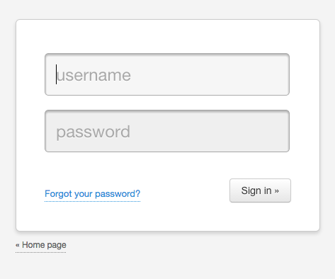

.. _quickstart:

=============================================
Introducción
=============================================

.. container:: lead

    Esta guía cubre lo que necesitas saber para empezar a usar Authcode.

Requisitos
=============================================

Aunque Authcode no depende de ningún framework web específico, si necesita que exista cierta infraestructura básica para funcionar:

- Una ``sesion`` con una interfaz similar a la de un diccionario.
    Debe permitir hacer cosas como ``sesion['foo'] = 'bar`` y ``sesion.get('foo', None)``. Tu framework ya debe de tener alguna. O si no puedes usar la de `Beaker`_.

- Un objeto ``request`` que represente a la solicitud de página actual. Por ahora solo soporta el formato de `Werkzeug`_ (Flask) y `WebOb`_ (Pyramid), pero es fácilmente extensible para trabajar con otros, como el de `CherryPy`_ por ejemplo.

- Un argumento ``db`` usado para comunicarse con SQLAlchemy. Si estás usando `SQLAlchemy_Wrapper`_ [#]_ o `Flask_SQLAlchemy`_ ya tienes uno.

.. _Beaker: http://beaker.readthedocs.org/
.. _Werkzeug: http://werkzeug.pocoo.org/
.. _WebOb: http://webob.org/
.. _CherryPy: http://www.cherrypy.org/
.. _SQLAlchemy_Wrapper: https://github.com/lucuma/SQLAlchemy-Wrapper/
.. _Flask_SQLAlchemy: http://pythonhosted.org/Flask-SQLAlchemy/

Inicio rápido
=============================================

Para usar Authcode bastan solo tres pasos.

Lo primero es configurar Authcode, hay varios parámetros que pudes usar, pero lo mínimo necesario es una clave secreta y la conexión a SQLAlchemy

.. code-block:: python

    auth = authcode.Auth(SECRET_KEY, db=db)

Lo siguiente es conectarlo a tu aplicación web, esta parte es específica del framework web que estés usando. Por ejemplo, para Flask:

.. code-block:: python

    authcode.setup_for_flask(auth, app)
    User = auth.User

``auth.user`` contiene el modelo de usuario generado automáticamente por Authcode. Necesitas esa referencia para crear usuarios o conectarlos a tus otros modelos.

Finalmente usas ``auth.protected`` para decorar las vistas que quieres que sean solo accesibles para usuarios.

.. code-block:: python

    @app.route('/')
    @auth.protected()
    def index():
        ...

.. note::

    Nota que el decorador está siendo llamado (tiene un par de paréntesis al final de la línea). Estos son necesarios, si los olvidas tendrás un error.

.. warning:: ¡Cuidado!
    Ten mucho cuidado en poner el decorador de autenticación **después** del de la ruta o, de otro modo, tus vistas quedarán desprotegidas.

Puedes ver este ejemplo completo en https://github.com/lucuma/authcode/tree/master/examples/minimal.

Authcode genera automáticamente vistas para inicar sesión, salir y recuperar tu contraseña, así que cuando intentes visitar esa vista, te redirigirá a una página para ingresar un usuario y contraseña (en el ejemplo ambos son “authcode”).

   Página estándar de inicio de sesión.

Puedes ver que esa página también tiene un enlace a otra para recuperar tu contraseña; El método es el estándar: escribes tu nombre de usuario y Authcode te envía a tu correo un enlace a una página especial en la que puedes elegir una nueva contraseña.

Al ejemplo le hace falta una cosa para que esto funcione: una forma de enviar el email. Eso es una funcionalidad que tiene que darle tu aplicación [#]_.

.. code-block:: python

    def send_auth_email(user, subject, msg):
        try:
            mailer.send(
                subject=subject,
                from_email=config.MAILER_FROM,
                to=user.email,
                html=msg
            )
        except Exception as e:
            print(e)

    authcode.setup_for_flask(auth, app, send_email=send_auth_email)

La función toma como argumentos el usuario que quiere recuperar su contraseña, el título del email y el cuerpo del mensaje (por defecto en HTML). Por supuesto que tienes que tener un email asociado al usuario, de modo que o bien usas su email como nombre de usuario o agregas un campo de email usando un *mixin* como se describe en la siguiente sección (:ref:`authentication`).

.. [#] `SQLAlchemy-Wrapper`_ te ahorrará mucho trabajo al tratar con ``SQLAlchemy``, independientemente si usas o no Authcode. En serio, dale una mirada.

.. [#] o también puedes desactivarla por completo en las opciones de configuración.
