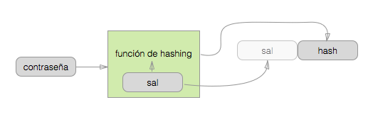
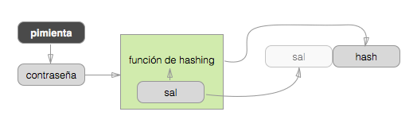

.. _security:

============================
Seguridad
============================

Lorem ipsum dolor sit amet, consectetur adipisicing elit, sed do eiusmod
tempor incididunt ut labore et dolore magna aliqua. Ut enim ad minim veniam,
quis nostrud exercitation ullamco laboris nisi ut aliquip ex ea commodo
consequat. Duis aute irure dolor in reprehenderit in voluptate velit esse
cillum dolore eu fugiat nulla pariatur. Excepteur sint occaecat cupidatat non
proident, sunt in culpa qui officia deserunt mollit anim id est laborum.

.. _about_passwords:

Sobre las contraseñas
=============================================

Las contraseñas no solo protegen tu sito si no que, como muchos suelen reusarla en muchos sitios, también son la llave de entrada a otros sistemas, por lo demás seguros.

.. pull-quote::

    La primera regla del manejo de contraseñas es que **nunca** guardas las contraseñas.

En cambio, lo único que guardas es un *hash* de la contraseña. Para verificar que la que te da un usuario es correcta, calculas su hash y lo comparas con el que tienes guardado.

.. pull-quote::

    La segunda regla del manejo de contraseñas es que no cualquier función de hashing sirve.

En primer lugar las funciones de hashing no debe de generar el mismo hash para contraseñas diferentes (es decir que es “resistente a colisiones”), o alguien podría entrar a tu cuenta con una contraseña diferente a la tuya!

En segundo lugar, muchos de las funciones más populares, como MD5, SHA1, etc. son muy rápidas y eficientes. Lo cual es perfecto para lo que fueron inventadas, pero es lo último que quieres para hashear contraseñas.

Cuando un atacante ha conseguido una copia de tu base de datos, ya que no es posible obtener la contraseña original desde el hash, lo que le queda  es probar uno por uno, los hash de todas las combinaciones de números, letras y símbolos. Es lo que se llama un ataque *por fuerza bruta*. Suena como un proceso imposíblemente largo, pero cuando usas una función de hashing que puede botar miles de resultados por segundo, es cuestión de horas ¡Incluso de minutos!

Por eso una función de hash para contraseñas debe estar *diseñada para ser lenta*. Las tres funciones de hashing que Authcode puede usar (``bcrypt``, `` sha_crypt`` y ``pbkdf2``) no solo lo son, sino que además retrasan todo el proceso calculando el hash final en muchas rondas, re-hasheando el hash del resultado anterior una y otra vez. `` sha_crypt`` por ejemplo, por defecto hace esto 100'000 veces.

Para los usuarios normales, esto significa una demora de apenas una fracción de segundo, pero para un atacante puede ser la diferencia entre minutos y semanas.

.. note::

    Diseñar un algoritmo de hashing no es algo que cualquiera puede/debe hacer. Estos tres algoritmos han sido revisados y probados a profundidad por expertos de todo el mundo durante por lo menos diez años.

Sal
---------------------------------------------

Aunque tome tiempo y/o recursos, podría pre-calcularse la tabla de hashes para todas las combinaciones de letras, números y símbolos hasta x caracteres. Una vez terminada, sería muy rápido comparar los hashes de los usuarios con los de la tabla, encontrando todas las contraseñas de ese largo o menos.

Para contrarestar ese ataque, se le agregar a la contraseña un grupo de letras, números y símbolos al azar para hacerla única.

La sal se genera al azar y cambia *para cada contraseña*. Y no es un secreto, su función es únicamente evitar las tablas precalculadas. Además necesitas tenerla para verificar las contraseñas, así que la guardas en “texto plano” concatenada al hash final.

Agregar una sal tiene la ventaja agregada que aunque dos contraseñas sean iguales sus dos hashes van a ser siempre diferentes.

Pimienta (o “sal global”)
---------------------------------------------

No importa que tan avanzado sea tu sistema de hashing si la contraseña que usas es “pasword”.

Otro tipo de ataque, órdenes de magnitud más rápido que la fuerza bruta, es un *ataque de diccionario*. Es básicamente probar una lista de palabras –y combinaciones de ellas— comúnmente usadas en contraseñas. “12345678”, “pizzapizza” o incluso variaciones como “p”$$word" y “123456789j” son casos perdidos contra este ataque.

Como la sal, la “pimienta” es un valor que se agrega a la contraseña antes de hashearla: tu “123456” se vuelve ``$pimienta . 123456``, pero a diferencia de la sal, este valor es único para todos los hashes del sistema, y no se guarda junto al hash original sino como un valor secreto dentro de tu código.

Aunque se tenga una copia de la base de datos, la teoría es que sin acceso al código fuente, incluso un ataque por fuerza bruta se vuelve prácticamente imposible [#]_.

.. warning::

    Aunque parece tener mucho sentido, no ha sido categóricamente “demostrado” que agregar una pimienta realmente aumente la seguridad; como tampoco hay absolutamente ningún indicio de que la reduzca.

    Por si las dudas, Authcode por defecto no usa una pimienta, a menos que tu le pases una como parámetro ``pepper`` (y haz que sea de al menos 32 caracteres).

.. _security_response:

Reportar un problema de seguridad
=============================================

.. container:: lead

    Apreciamos tu preocupación.

Mantener la seguridad de una biblioteca de autenticación es crítico, por que afecta potencialmente a todos los que la usan. Tus opiniones y comentarios al respecto son siempre bien recibidos.

Si el problema que quieres reportar es urgente o sensible (puede causar que un atacante tenga acceso a la información de otro usuario o que pueda suplantarlo) envíalo diréctamente a security@lucumalabs.com. Usa `nuestra llave pública <http://lucumalabs.com/lucuma-security.pub>`_ para mantener tu mensaje seguro y por favor danos una forma segura para responder. Te responderemos apenas nos sea posible, usualmente dentro de 24 horas.

Para otro tipo de problemas, por favor crea un reporte en https://github.com/lucuma/authcode/issues .

.. rubric:: Notas al pie

.. [#] O económicamente impráctico si eres la NSA. Pero no olvides esto: http://xkcd.com/538/
